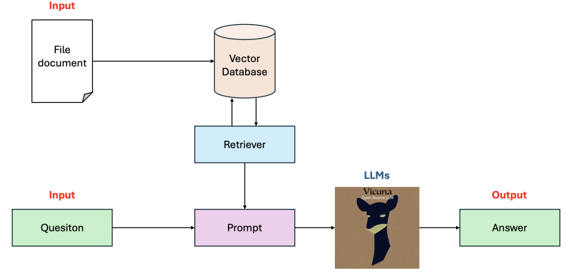

# Project Module 1: RAG in asking questions and answering content extracted from PDF documents

## Introduction

**Large Language Models (LLMs)**: These models allow users to input any text and receive a relevant response. Popular applications include ChatGPT and Gemini.

**Retrieval Augmented Generation (RAG)**: This technique enhances LLM responses by integrating content from a document source to answer an input query. This project demonstrates building a basic RAG program, applied to answering questions from course documents.

- **Input**: Document file and a related query.
- **Output**: The answer.



## Code

### Google Colab

1. Clone the repository. Then open and run RAG_pdf.file
```
git clone https://github.com/TungTSon/RAG_PDF.git
```
2. Upload a different PDF file and replace `FILE_PATH` with your path.
3. Run the provided cells.

### Local Setup

If using Anaconda, create and activate an environment:

```sh
conda create -n my_env
conda activate my_env
```
